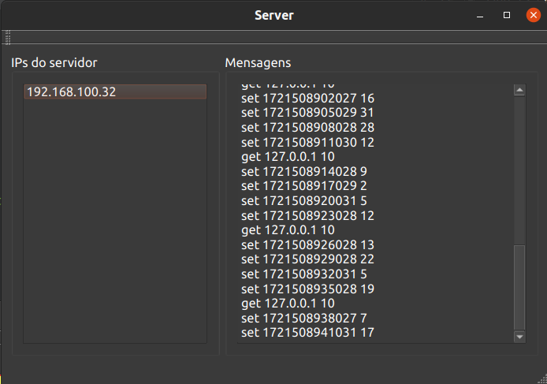
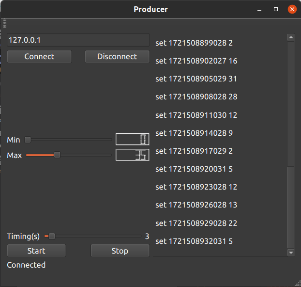
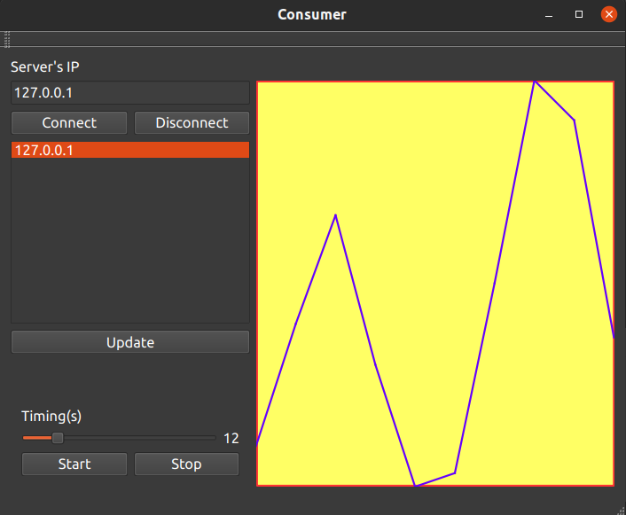

# Projeto de Programação Orientada a Objetos com Qt

## Descrição

Este projeto visa desenvolver habilidades em programação orientada a objetos utilizando a biblioteca Qt. O projeto inclui três módulos que trabalham juntos para simular um sistema de aquisição e supervisão de dados usando comunicação TCP/IP em uma rede local.

Os três módulos são:

1. **Servidor TCP**: Espera conexões na porta 1234 e responde aos comandos dos clientes.
2. **Cliente Produtor de Dados**: Conecta-se ao servidor e envia dados para armazenamento.
3. **Cliente Supervisor de Dados**: Conecta-se ao servidor, recupera listas de clientes produtores e dados armazenados.

## Módulos

### Servidor

O módulo servidor é um servidor TCP que escuta na porta 1234 para conexões de clientes. Ele aceita três comandos principais:

- `get NUMERO_IP N_AMOSTRAS`: Recupera dados de um cliente produtor específico.
- `set DATA_E_HORA_EM_MS DADO`: Armazena dados enviados por um cliente produtor.



### Cliente Produtor de Dados

O cliente produtor deve se conectar ao servidor e enviar dados periodicamente. As funcionalidades incluem:

- Configurar IP do servidor
- Definir faixa de valores e intervalo de tempo
- Conectar e enviar dados ao servidor
- Exibir dados enviados



### Cliente Supervisor de Dados

O cliente supervisor deve se conectar ao servidor e recuperar informações sobre os clientes produtores e seus dados. As funcionalidades incluem:

- Configurar IP do servidor
- Conectar e obter lista de máquinas produtoras
- Selecionar uma máquina e visualizar seus dados
- Traçar gráficos dos dados



## Instalação

1. **Clone o repositório:**

   ```bash

    git clone <URL-DO-REPOSITORIO>

2. **Abra o projeto no QtCreator**

3. **Compile e execute o servidor**

4. **Compile e execute os módulos cliente conforme necessário**

## Uso

### Servidor

- Compile e execute o servidor no QtCreator.
- O servidor exibirá o IP local na aba Application Output.

### Produtor

- Configure o IP do servidor, faixa de valores, e intervalo de envio.
- Conecte-se ao servidor e inicie a transmissão de dados.

### Supervisor

- Configure o IP do servidor e conecte-se.
- Visualize a lista de máquinas e selecione a desejada para exibir seus dados e gráficos.